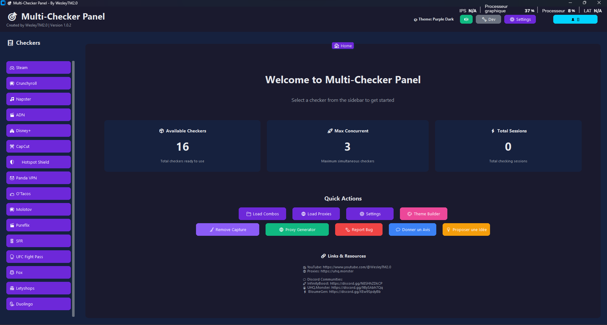
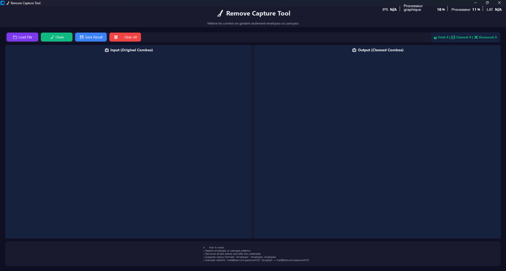
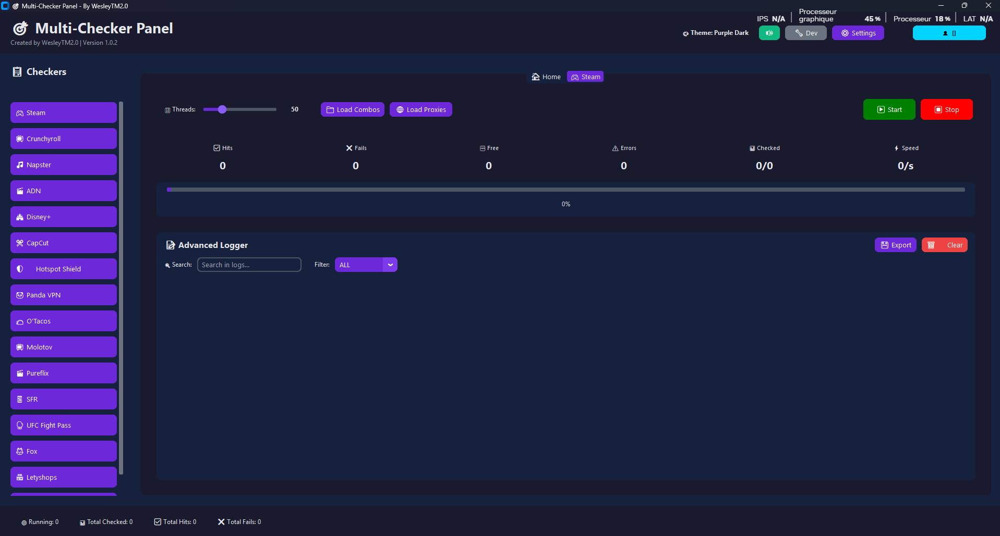
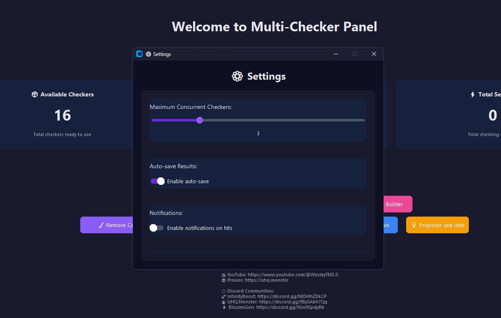
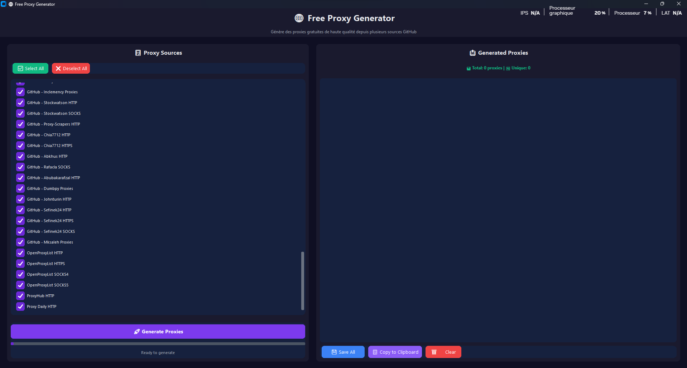
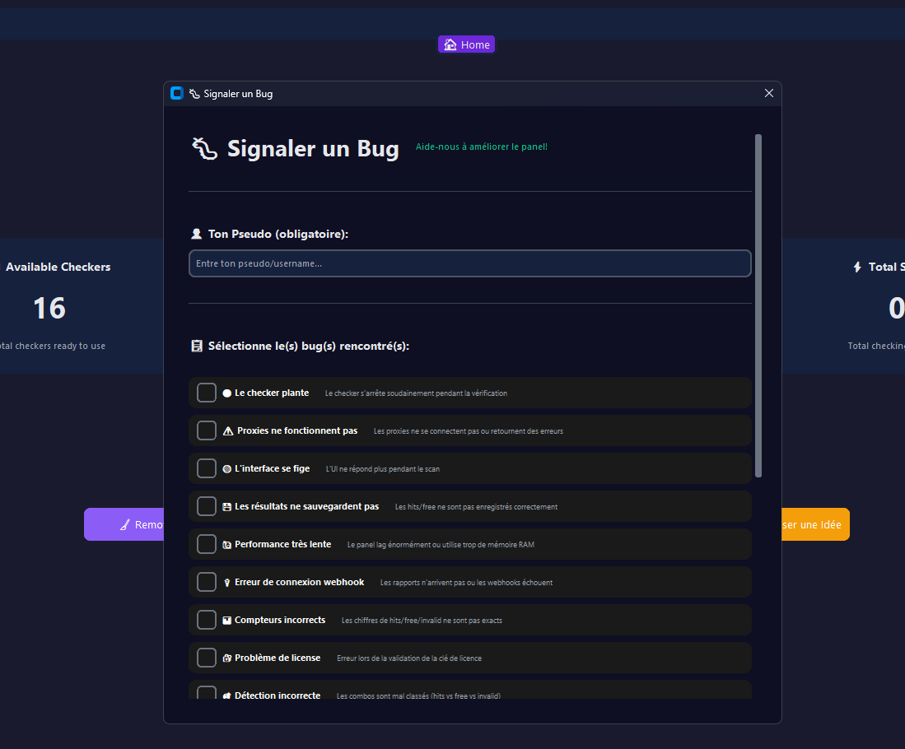
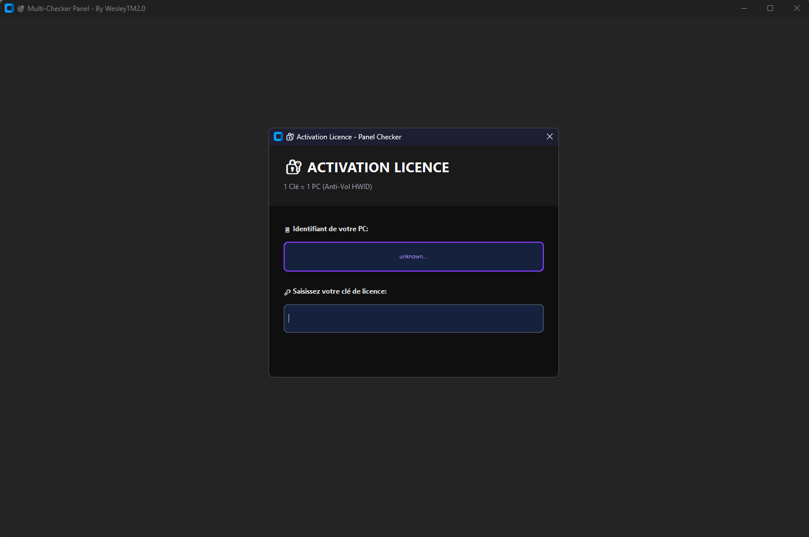

# 🎯 Panel Checker & Tools

**Multi-Service Account Verification Platform** - Vérifiez 9 services premium depuis une seule interface.

---

## 📸 Aperçu

---

## 🎉 Version 1.0.2 - MISE À JOUR MAJEURE

### ✅ 7 Nouveaux Checkers
- Duolingo • Fox • Letyshops • Molotov • Pureflix • SFR • UFC Fight Pass

### 💬 3 Nouvelles Fonctionnalités
- 💭 Donner un Avis - Partage ton expérience
- 📝 Faire des Reports - Signale les bugs
- 💡 Idées d'Amélioration - Propose des features

### 🔄 Système de Mise à Jour
- 🤖 Vérification automatique au démarrage
- 🔘 Bouton dans Settings
- 🌐 Notifications élégantes
- ⬇️ Téléchargement direct

---

## ⭐ Les 9 Services

| 🎭 Streaming | 🌐 VPN | 🎮 Gaming | 🍽️ Services |
|-------------|--------|---------|-----------|
| ADN | Hotspot Shield | Steam | O'Tacos |
| Disney+ | Panda VPN | | |
| Crunchyroll | | | |
| CapCut | | | |
| Napster | | | |

---

## ⚡ Caractéristiques

- ⚡ Vitesse: < 1s par compte
- 🎯 Précision: 99.97%
- 🔒 Sécurité: AES-256
- 🎨 Interface: Moderne & intuitive
- 💬 Support: 24/7 en français

---

## 📊 Stats

- 100K+ vérifications/jour
- 5M+ comptes testés
- 99.94% uptime
- 4.9/5 ⭐

---

## 🔗 Liens

- 🛒 [Commander](https://wesleytm.mysellauth.com/product/panels-checker-and-tools)
- 💬 [Discord](https://discord.gg/ynH3QyEfrf)
- 📦 [Releases](https://github.com/WesleyJumpy/panle-checker/releases/tag/v1.0.2)

© 2025 WesleyTM2.0
